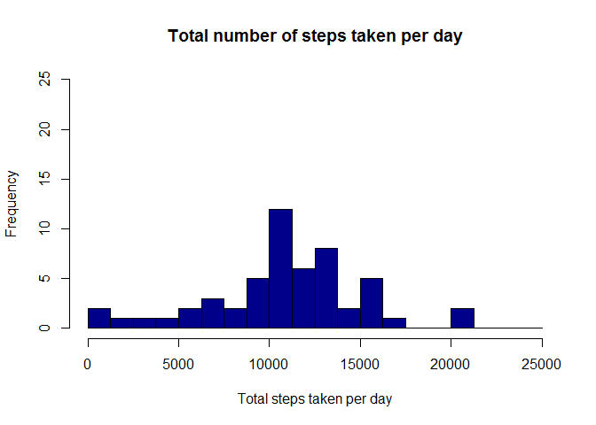
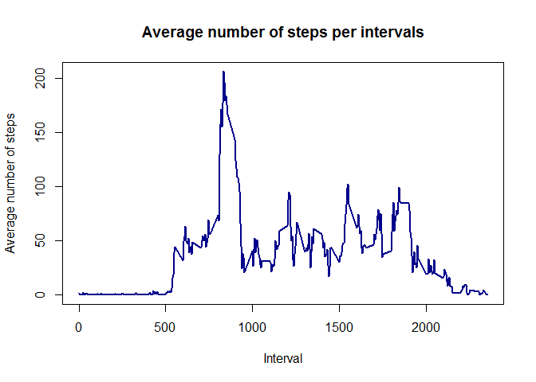
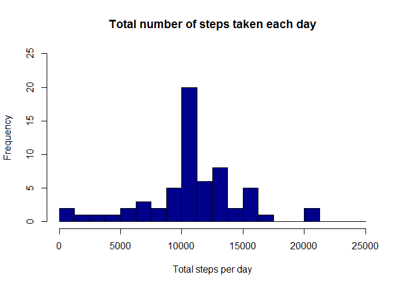
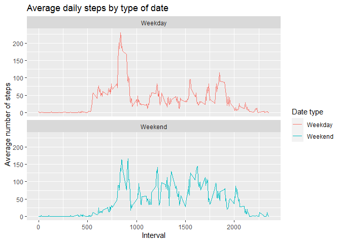

Massimiliano Veltroni  

February 2, 2021  

==============================================  

It is now possible to collect a large amount of data about personal movement using activity monitoring devices such as a **Fitbit, Nike Fuelband, or Jawbone Up**. These type of devices are part of the “quantified self” movement – a group of enthusiasts who take measurements about themselves regularly to improve their health, to find patterns in their behavior, or because they are tech geeks. But these data remain under-utilized both because the raw data are hard to obtain and there is a lack of statistical methods and software for processing and interpreting the data.

In this assignment we make use of data from a personal activity monitoring device. This device collects data at 5 minute intervals through out the day. The data consists of two months of data from an anonymous individual collected during the months of October and November, 2012 and include the number of steps taken in 5 minute intervals each day.

### Assignment
This assignment will be described in multiple parts. We need to write a report that answers the questions detailed below. Ultimately, we need to complete the entire assignment in a single R markdown document that can be processed by knitr and be transformed into an HTML file.

Questions to be answered:

What is mean total number of steps taken per day?
What is the average daily activity pattern?
Imputing missing values
Are there differences in activity patterns between weekdays and weekends?  

### The Dataset 
You can download the used dataset from [Dataset site](https:\\d396qusza40orc.cloudfront.net\repdata%2Fdata%2Factivity.zip)

The variables included in this dataset are:  

+ **steps**: Number of steps taking in a 5-minute interval (missing values are coded as *NA*)
+ **date**: The date on which the measurement was taken in YYYY-MM-DD format
+ **interval**: Identifier for the 5-minute interval in which measurement was taken

The dataset is stored in a comma-separated-value (CSV) file and there are a total of 17,568 observations in this dataset.

## Loading and preprocessing the data
Below R code load data from the zipped archive.


```r
library(lubridate)
library(dplyr)
library(ggplot2)
activity <- read.csv(unz("repdata_data_activity.zip", "activity.csv"), header=T, sep=",")
```

** *Please remember to save dataset zip file on Your working directory* **

Date is transformed from character variable to date and weekday is added to the dataframe as column (usefull in the following part of this assignment).

```r
activity$date<-ymd(activity$date)
weekday <- weekdays(activity$date)
activity <- cbind(activity,weekday)
```

Dataset is now stored in *activity* dataframe; below a short presentation:

```r
head(activity)
```

```
##   steps       date interval weekday
## 1    NA 2012-10-01        0  lunedì
## 2    NA 2012-10-01        5  lunedì
## 3    NA 2012-10-01       10  lunedì
## 4    NA 2012-10-01       15  lunedì
## 5    NA 2012-10-01       20  lunedì
## 6    NA 2012-10-01       25  lunedì
```

and

```r
summary(activity)
```

```
##      steps             date               interval        weekday         
##  Min.   :  0.00   Min.   :2012-10-01   Min.   :   0.0   Length:17568      
##  1st Qu.:  0.00   1st Qu.:2012-10-16   1st Qu.: 588.8   Class :character  
##  Median :  0.00   Median :2012-10-31   Median :1177.5   Mode  :character  
##  Mean   : 37.38   Mean   :2012-10-31   Mean   :1177.5                     
##  3rd Qu.: 12.00   3rd Qu.:2012-11-15   3rd Qu.:1766.2                     
##  Max.   :806.00   Max.   :2012-11-30   Max.   :2355.0                     
##  NA's   :2304
```

## What is mean total number of steps taken per day?
Let's see as an Histogram showing **frequency of total steps in each day** using Base Plotting System:

```r
activity_total_steps <- with(activity, aggregate(steps, by = list(date), FUN = sum, na.rm = TRUE))
names(activity_total_steps) <- c("date", "steps")
hist(activity_total_steps$steps, main = "Total number of steps taken per day", xlab = "Total steps taken per day", col = "darkblue", ylim=c(0,25), breaks = seq(0,25000, by=1250))
```

<!-- -->

**Mean** and **Median** are calculated on steps number for each day.

```r
steps_mean<-mean(activity_total_steps$steps)
steps_median<-median(activity_total_steps$steps)
print(paste("Steps Mean is ",steps_mean," and Median is ", steps_median))
```

```
## [1] "Steps Mean is  9354.22950819672  and Median is  10395"
```

## What is the average daily activity pattern?
Now we are going to answer the question "What is the average daily activity pattern?" using a plot. We make a time series plot (i.e. type = "l") of the 5-minute interval (x-axis) and the average number of steps taken, averaged across all days (y-axis).

```r
average_daily_activity <- aggregate(activity$steps, by=list(activity$interval), FUN=mean, na.rm=TRUE)
names(average_daily_activity) <- c("interval", "mean")
plot(average_daily_activity$interval, average_daily_activity$mean, type = "l", col="darkblue", lwd = 2, xlab="Interval", ylab="Average number of steps", main="Average number of steps per intervals")
```

<!-- -->

On average across all the days in the dataset the interval containing the maximum number of steps is calculated and reported by the R code below.

```r
average_daily_activity[which.max(average_daily_activity$mean), ]$interval
```

```
## [1] 835
```

## Inputing missing values
There are a number of days/intervals where there are missing values (coded as NA). The presence of missing days may introduce bias into some calculations or summaries of the data.

Let's calculate and report the total number of missing values in the dataset.


```r
sum(is.na(activity$steps))
```

```
## [1] 2304
```

To fill NA values, we are going to use mean value for this interval calculated over all days.


```r
steps_NA_fill <- average_daily_activity$mean[match(activity$interval, average_daily_activity$interval)]
```

We create a new dataset that is equal to the original dataset but with the missing data filled in based on above strategy.


```r
activity_NA_fill <- transform(activity, steps = ifelse(is.na(activity$steps), yes = steps_NA_fill, no = activity$steps))
total_steps_fill <- aggregate(steps ~ date, activity_NA_fill, sum)
names(total_steps_fill) <- c("date", "daily_steps")
```

We plot an histogram of the total number of steps taken each day.


```r
hist(total_steps_fill$daily_steps, col = "darkblue", xlab = "Total steps per day", ylim = c(0,25), main = "Total number of steps taken each day", breaks = seq(0,25000,by=1250))
```

<!-- -->

**Mean** and **Median** are calculated on steps number for each day based on this *filled* dataset.

```r
steps_mean_f<-mean(total_steps_fill$daily_steps)
steps_median_f<-median(total_steps_fill$daily_steps)
print(paste("Steps Mean is ",steps_mean_f," and Median is ", steps_median_f))
```

```
## [1] "Steps Mean is  10766.1886792453  and Median is  10766.1886792453"
```
These values are different from the values calculated in first part of the assignment. 

```r
print(paste("Mean with NA filled values is ", steps_mean_f," and with original values was ", steps_mean,".", "The difference is ", (steps_mean_f-steps_mean), ".","Median with NA filled values is ", steps_median_f," and with original values was ", steps_median,".", "The difference is ", (steps_median_f-steps_median)))
```

```
## [1] "Mean with NA filled values is  10766.1886792453  and with original values was  9354.22950819672 . The difference is  1411.95917104856 . Median with NA filled values is  10766.1886792453  and with original values was  10395 . The difference is  371.188679245282"
```

Filling the NA data with choosen strategy has increased the mean and median values that are now equal.

## Are there differences in activity patterns between weekdays and weekends?
We create a new factor variable in the dataset with two levels “weekday” and “weekend” based on weekday as created at the beginning of the assignment.


```r
activity_NA_fill$datetype <- sapply(activity_NA_fill$weekday, function(x) {
        if (x == "sabato" | x =="domenica") 
                {y <- "Weekend"} else 
                {y <- "Weekday"}
                y
        })
```
Now we can make a panel plot containing a time series plot (i.e. type = “l”) of the 5-minute interval (x-axis) and the average number of steps taken, averaged across all weekday days or weekend days (y-axis). 


```r
activity_by_date <- aggregate(steps~interval + datetype, activity_NA_fill, mean, na.rm = TRUE)
plot<- ggplot(activity_by_date, aes(x = interval , y = steps, color = datetype)) +
       geom_line() +
       labs(title = "Average daily steps by type of date", x = "Interval", y = "Average number of steps") +
       facet_wrap(~datetype, ncol = 1, nrow=2)
print(plot)
```

<!-- -->

